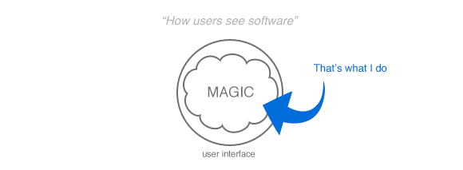



# I am the web mage.

I do all kinds of things, but there's one that always keeps my excited. To *amaze* users. Let me show you what I mean.

I'm focused on frontend but I do backend work when needed. This is the tech I use to make magic happen.

`Ruby`, `Rails`, `JavaScript/CoffeeScript`, `Node.js`, `HTML5/CSS3`, `Objective-C`, `Cocoa Touch/Desktop`, `SQL`, `NoSQL`, `UI Design`

# Projects

  

    
    <h3>Edukit</h3>
    
Share Intel. Edukit turns conversations to knowlege. It has web and mobile application and is super fast!

  

  
  

    
    <h3>Atmos2</h3>
    
Open-source framework for retal-time data synchronization in JavaScript and Cocoa apps.

  

  
  

    
    <h3>Zone</h3>
    
Can't focus on work? Zone will help you. It also provides nice reports so you could see when is your most productive time.

  

  
  

    
    <h3>TextDo</h3>
    
Simple Mac app that lets you write down todos as text documents.

  

