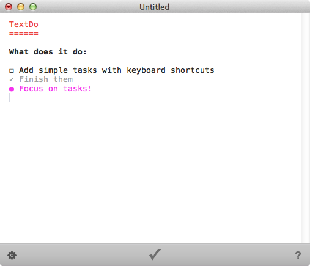



  

    <h1>TextDo will be your favorite note-taking app.</h1>

    <ul>
      <li>It highlights your notes for things like titles and sections (you can choose between dark and light color scheme)</li>
      <li>It lets you create tasks inside your notes just by pressing the task button</li>
      <li>It's still plain text documents that you can share with people, or save in the Cloud with DropBox</li>
    </ul>

  

  
  

    
  

<!-- .item -->